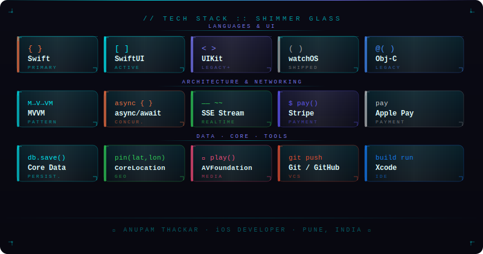

<div align="center">


<br/>


<br/>

[](https://anupamthackar.in)&nbsp;
[](https://linkedin.com/in/anupamthackar)&nbsp;
[](mailto:anupamthackar@gmail.com)


</div>

---

```
╔══════════════════════════════════════════════════════════════╗
║  UNIT       :: Anupam Thackar                                ║
║  ROLE       :: iOS Developer @ NeoSoft Technologies          ║
║  LOCATION   :: Mumbai, Maharashtra, India                      ║
║  STATUS     :: Active — Open to new missions                 ║
║  CLEARANCE  :: Mobility · Travel · Insurance · Banking       ║
╚══════════════════════════════════════════════════════════════╝
```

iOS Developer with **1.8+ years** deploying production iOS and watchOS applications. Specialized in **SwiftUI**, **MVVM architecture**, and **AI-powered feature integration** — SSE streaming, speech-to-text, WatchConnectivity sync. Led UIKit → SwiftUI modernization and shipped across 4 industry verticals with US client exposure.

```
  CURRENT MISSION  ::  AI-assisted iOS features · watchOS development
  OPEN TO          ::  iOS Developer roles — remote & on-site across India
```

---

## `// TECH STACK`

<div align="center">

<!-- Shimmer glass skill banner — upload skills-banner.svg to your repo and update path below -->
<!-- -->


</div>

---

## `// CERTIFICATIONS & ACHIEVEMENTS`

```
╔══════════════════════════════════════════════════╗
║  CERTIFICATION LOG :: Scaler Academy             ║
╠══════════════════════════════════════════════════╣
║  [✓]  Data Structures & Algorithms               ║
║  [✓]  Low-Level Design  (LLD)                    ║
║  [✓]  High-Level Design (HLD)                    ║
║  [✓]  Python Programming                         ║
║  [✓]  SQL Database Management                    ║
╚══════════════════════════════════════════════════╝
```

```
╔══════════════════════════════════════════════════╗
║  ACHIEVEMENT LOG                                 ║
╠══════════════════════════════════════════════════╣
║  [★]  Top 10% — Scaler Academy challenges        ║
║  [★]  500+ DSA problems solved                   ║
║  [★]  US client delivery — Cinko (Travel/US)     ║
║  [★]  B.Tech CSE — MIT ADT University · 7.16     ║
╚══════════════════════════════════════════════════╝
```

---

<div align="center">

`// END OF TRANSMISSION`


</div>
